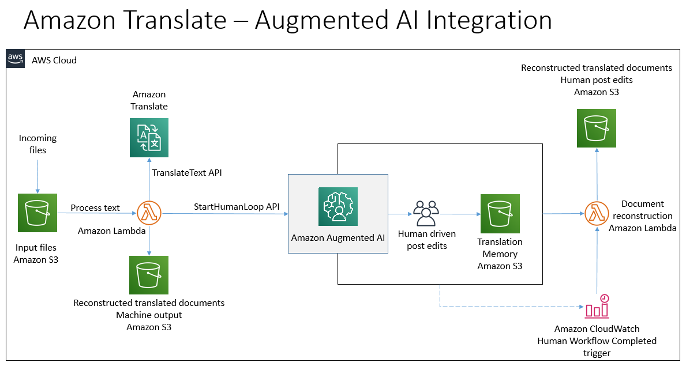

# translate-a2i-human-workflow
An Amazon Translate and Amazon Augmented AI driven workflow to post edit machine translated documents.

# Solution Architecture




## Prerequisites

1. Download and install the latest version of Python for your OS from [here](https://www.python.org/downloads/). We shall be using Python 3.8 and above.

2. You will be needing [AWS CLI version 2](https://docs.aws.amazon.com/cli/latest/userguide/cli-chap-install.html) as well. If you already have AWS CLI, please upgrade to a minimum version of 2.0.5 follwing the instructions on the link above.


## Deployment Instructions

1. Download the contents of this repository on your local machine (say: project-directory)

2. The solution is implemented in python, so make sure you have a working python environment on your local machine.

3. Create a [private workforce](https://docs.aws.amazon.com/sagemaker/latest/dg/sms-workforce-management-private-console.html) from the Amazon Sagemaker console.

4. Create a [Custom Worker Template](https://docs.aws.amazon.com/sagemaker/latest/dg/a2i-create-worker-template-console.html) from Amazon Augmented AI console. Use the file **/code/ui/translate_template.html** as the custom template.

5. Create a [Flow Definition](https://docs.aws.amazon.com/sagemaker/latest/dg/a2i-create-flow-definition.html#a2i-create-human-review-console) from the Amazon Augmented AI console.
    1. Use **s3://ta2i-demo/tms** for S3 Bucket.
    2. For IAM role, choose 'Create a new role'.
    3. For Task Type, choose 'Custom'
    4. For Template, choose the custom worker template you created in step 4 above.
    5. For Worker Types, choose 'Private'.
    6. For Private Teams, choose the team you created in step 3 above.
    7. After creation, copy the **Flow Definition ARN**. We will use it later.

6. Create a S3 bucket for deployment (note: use the same region throughout the following steps, I have used us-east-1, you can replace it with the region of your choice. Refer to the [region table](https://aws.amazon.com/about-aws/global-infrastructure/regional-product-services/) for service availability.)
    1. ```bash
        aws s3 mb s3://ta2i-cf-2020-us-east-1 --region us-east-1
        ```
7. Create another S3 bucket - this will be used by the solution to accept inputs and provide outputs. 
    1. ```bash
        aws s3 mb s3://ta2i-working-2020-us-east-1 --region us-east-1
        ```

8. For rest of the setup, we will use the CloudFormation template. Navigate to the /code/source sub directory. Package the contents and prepare deployment package using the following command
    1. ```bash
        aws cloudformation package --template-file translate-a2i-setup.yaml --output-template-file translate-a2i-setup-output.yaml --s3-bucket ta2i-cf-2020-us-east-1 --region us-east-1
        ```
9. Deploy the SAM package using the command below. Replace the 'flowdefarn' placeholder in the below command with flow definition ARN identified in the steps above and run the command:
    1. ```bash 

        aws cloudformation deploy  --template-file translate-a2i-setup-output.yaml --capabilities CAPABILITY_IAM  --region us-east-1 --parameter-overrides FlowDefinitionARNParameter=flowdefarn S3BucketNameParameter=ta2i-working-2020-us-east-1  --stack-name Translate-A2I
        ```
10. If you want to make changes to the Lambda functions, you can do so on your local machine and redeploy them using the steps 5 through 6 above. The package and deploy commands take care of zipping up the new Lambda files (along with the dependencies) and uploading them to AWS for execution.

## Execution Instructions

1. Navigate to S3 console and upload a text file (english) to **ta2i-working-2020-us-east-1/source** folder.
2. Navigate to Amazon SageMaker console. Under Labelling workforces -> Private, click on the URL under **Labeling portal sign-in URL**.
3. Login with appropriate credentials.
4. You should see a task assigned to you. Choose the task and click on "Start Working".
5. You can 'post edit' the machine output on the right hand side of the UX.
6. Click Submit when done.
7. The solution will translate the text to **spanish** and create a txt file under **ta2i-working-2020-us-east-1/machine_output**. This is the direct ouptut from Amazon Translate.
8. You can find the post edited file under **ta2i-working-2020-us-east-1/post_edits** folder.
9. The translation memory (created by the human workflow) can be found under **ta2i-working-2020-us-east-1/tms**.

## Further Reading:
1. Blogpost: [Designing Human Review workflows using Amazon Translate and Amazon Augmented AI ](http://aws.amazon.com/)

## License

This library is licensed under the MIT License. 
